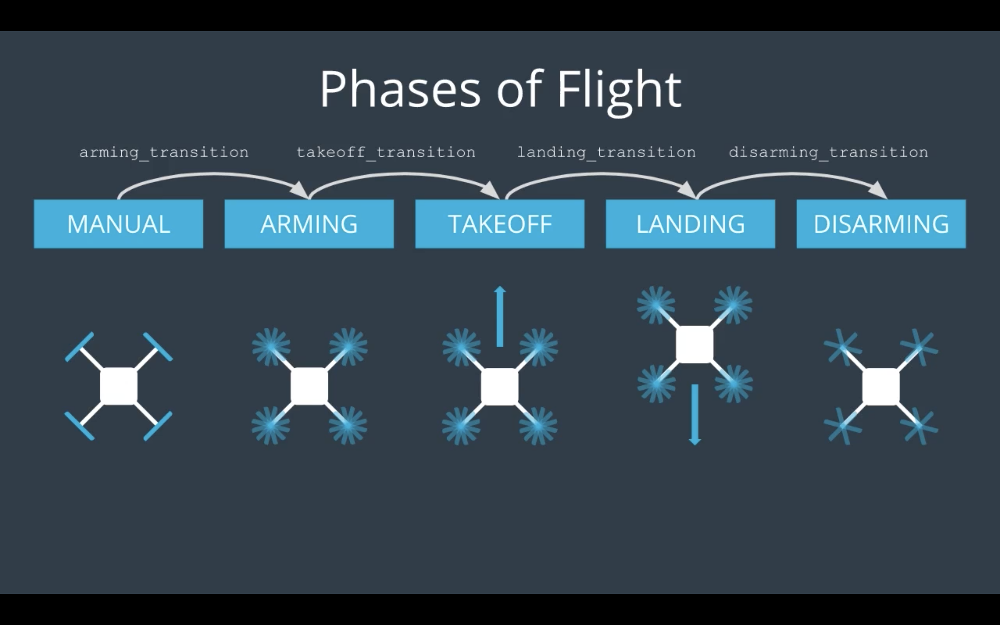
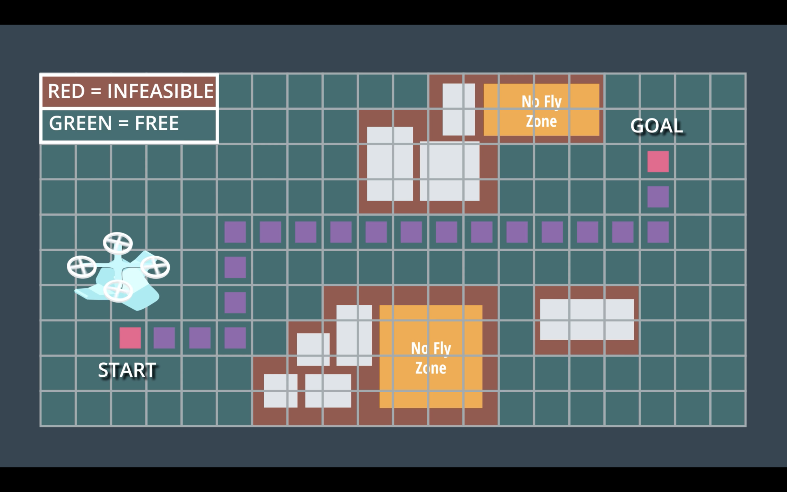
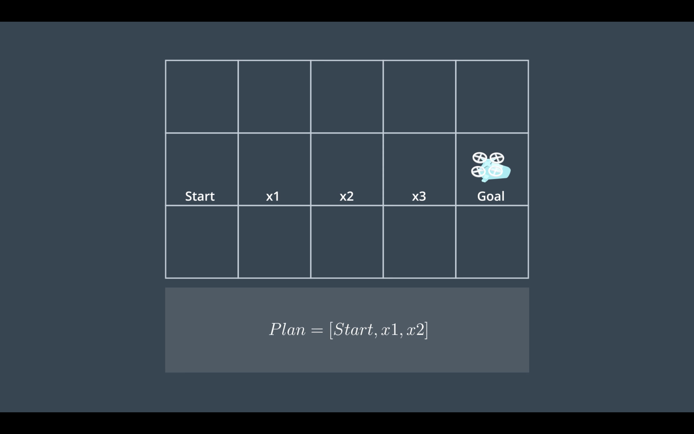

# CHAPTER - 1: INTRODUCTION TO AUTONOMOUS FLIGHT

## First Module: Welcome!


> Exciting time to focus on flying cars, we already see the basic version of a flying car in present time, its the quad-rotor  drone, from this we build up on topics to reach the flying car fantasy!

> Flying cars is going to be a state of the art industry, Companies focusing on flying cars in the present time are:


- Airbus


- Kitty Hawk


- Tencent


- NASA


- Boeing


- UBER


Projects being Built in this Course:


- The Backyard Flyer


- 3D motion Planning


- Building a controller for Quad-rotor in C++


- Estimation of a Flying vehicle's position


- Fixed wing control Project


                                             END OF FIRST MODULE           
---


## Module-2: Autonomous FLIGHT


> Autonomous flight is not a new thing if you have ever been on an airplane then you have already flew in an autonomous vehicle, the basics about autonomous flight can be best learned by learning about quadrotors, which later in this Course will be writing a code to make it fly autonomously.


> Wilbur and Orville wright brother were first one's to create an aircraft back in 1903 near kittyhawk, north carolina, the reason why there aircraft worked is due to the grater control of the airplane rather than stability, pilot had easier control over the airplane which made the flight possible, after that Elmer sperry invented the first autopilot know as "Mechanical Mike" which had a couple of gyroscopes that kept the airplane stable and helped in navigational tasks.


## Vehicle Morphology:  


> To investigate which aircraft configuration best suits the flying car, there are 2 configurations to consider 1) fixed wing style 2) rotary wing style, both have their own advantages, fixed style has higher flight efficiency and can travel larger distances, while rotary wing style had VTOL capability, the ability to land and takeoff vertically which makes it suitable for urban environment.


## Why Quad-rotors:


> Quad-rotors are tiny flying helicopters with 4 propellers, they are chosen as the platform to test code of Flying cars because of their light weight structure, cheaply available electronics such as flight controller and high density batteries such as Lipo and miniature GPS available in the market makes it suitable to learn about drones.


## Basic Quad-rotor components:


> A quad-rotor has 4 propellers attached to motor sitting on an X-frame, the propellers sitting opposite to each other basically rotate in the same direction, to cancel out the torque generated from each pair, apart from that a basic quad-rotor has following components:


- An IMU


- GPS


- Camera


- Flight controller


- Autopilot


## Below picture indicates the motor directions of a quad-rotor:


## 1) Quad-rotor Frame:


> A quad-rotor frame is a simple structure needed for fastening the electronics, a simple x-frame with good strength and flexibility will suffice for a frame, although studies are being conducted for an optimal frame in terms of material and aerodynamics.


## 2)Motors and Speed controllers:


> We use motors in quad-rotors as they are simple, even thought not efficient, they only need a battery, brushless dc motors are commonly used in quad-rotors as they work on principle of oscillating magnetic field they do not need any contact brushed which makes them efficient and faster than the brushed motors, ESC's are used to control the speed of the motor, the Autopilot send a command to ESC's regarding how much thrust is needed and the ESC adjust the magnetic field to a certain RPM of the motor.


## 3)Propellers:


> Each motor of a quad-rotor is attached to a propeller, the thrust generated by a propeller is the function of how fast the motor is spinning and also the properties of a propeller.


> Propellers drive the air in a single direction, its either a tractor which pushes the air downward or a pusher wich pushes the air upwards, quad-rotors basically have tractor propellers.


> Quad-rotors have two counter-clockwise rotors and two clockwise rotors in order to accommodate zero net torque.

> Propellers also have a radius, bigger the propeller quieter and efficient it gets, but there is a limit on propeller size based on the Frame.


> Pitch of the propeller is the twist associated with it in the plane of rotation, bigger pitch props generally displace more air and are efficient but produce lower thrust, hence if the purpose is to lift heavier loads we should go with lower pitch props but they are less efficient and drain the battery easily, there exists variable pitch propellers which can do low pitch for hover and high pitch for faster forward motion, but they are too complicated.


## 4)Batteries:


> Batteries used in the quad-rotors are Lithium Polymer batteries, just as the one's in laptops and cellphones but what makes them different is that they discharge very quickly which can be dangerous, Lipo batteries and a group of cells connected together and should be charged carefully, making sure one cell wont charge the other or discharge into other, which can be catastrophic.

> 99 percent of the battery power on the quad-rotor is consumed by the brushless d.c motors.


## 5) Driving a quad-rotor:


> when thrust on all 4 motors is same the quad-rotor hovers, to move the quad-rotor to the left thrust on the motors adjacent to each other will be increased, now increase int the thrust of 2 motors on the right causes the net thrust vector to shift to the left and the drone starts to move to the left, to make it move to the right same will be done but on to the left.


## Drone Movement:


## Drone Attitude Control:


> We know it takes to change thrust vectors of four motors on a quad-rotor to move it in different direction, it also doesn't take long to realize that it is really hard to manually change these thrust vectors every-time we want to change the drone's movement and for this purpose we need an Autopilot.


## Drone axis Diagram:


## 6) Autopilot:


> An Autopilot is a computer that is used to control the intended thrust vector, or thrust required to the motors, to control the Attitude of the drone it first needs to know the Attitude itself, how can this be done? using sensors.


## 7) IMU gyros:


> To find the attitude of the vehicle we use an inertial measurement unit, IMU consists of 3 gyroscopes and 3 accelerometers inside them, so when vehicle rotates in any of the 3 axis, we can measure change in its position using 3 gyroscopes placed at right angle to each other, if we want to measure this change relative to a reference then we need accelerometers for that purpose.


## 8) IMU accelerometers:


> IMU accelerometers use gravity as a reference to know which way down is, IMU has 3 accelerometers to measure acceleration in x, y and z directions simultaneously, we can calibrate these accelerometers when they are facing acceleration only due to gravity and use as a reference for gyros, present days we have MEMS or Micro electrical mechanical systems that enables us to embed this IMU on to small chip or a drone autopilot.


## 9) GPS :


> A GPS is used to get the position of the drone when it is moving, an IMU is used to verify the attitude of the vehicle but to actually know if the vehicle is reaching its position we need have GPS, GPS in an itself as a source for position is very inaccurate hence we use information from multiple sensors and fuse them to make the correct estimate of position.


## 10) Flight Computer:


> Flight computer is the brain of the drone which plans the high level stuff, it is responsible for planning the trajectory of drone and send the required thrust vector commands to the autopilot for producing required thrust to reach the destination.


## The Autopilot Loop:


## The Flight controller Loop:


                                              END OF SECOND MODULE
---         


# PROJECT-1: THE BACKYARD FLYER


> The Goal of this project is to implement a simple flight plan for a drone using Event-driven programming paradigm, This event-driven programming paradigm will allow to write drone programs that respond dynamically to a drone's changing and unpredictable world.


There are two modes for the drone in a simulator:


 - Manual- user is the pilot and motors need to be armed before performing tasks


 - Guided- Autonomous mode, drone can be controlled by providing scripts to the flight controller


## Manual Mode Video:

Click on the Picture to view the Video:


[](https://youtu.be/l7H_LN24nfk)


> Before running the code, environment setup need to be done in miniconda, after downland all the necessary requirements and repositories we can activate the environment using following command:

```sh
$ source activate fcnd
```


## Guided mode drone control:


> Now we write our own python code to make the drone move by itself in self-guided mode, for that 3 pre-requisites must be fulfilled:


- Activate the Environment.


- Open the python shell or python notebook.


- Make sure the simulator is open and guided mode is selected.


Click on the picture to view the Video:


[](https://youtu.be/8Yp-g_g8OAc)


## Event Driven programming:

> Event driven programming is paradigm in which flow execution is defined by external events rather than following a predefined sequence of Steps, we use this paradigm while making GUI's, Drones and Chatbots.


> We use this Event driven programming in coding flight plans for drones, these flight plans are dependent on what are called as phases.




## Terminology:


> Udacity Drone Python API provides a protocol agnostic API for communicating with the Drone, what it means is method of data transmission is irrelevant to program or device's function.

> The above API has two types of classes the Drone class and the connection classes

> The Drone class provides the representation of Physical (or) simulated drone exposing the core API enabling interaction with the connected drone. Through this class we are able to retrieve the state information of the vehicle and send various commands, this is communication protocol independent meaning, the code we write will work on any drone (or) simulator with an implementation of Connection class.

>Connection classes are protocol specific implementation of abstract 'Connection' class enabling the drone to be configured to communicate over several different protocols used with drones today, while the Drone API is designed to be independent of the protocol, in order to communicate with different types of drones, implementation of each designed protocol must be built in the backend.Currently Udacidrone supports

- Mavlink protocol, which is on any PX4 powered drone

- cflib protocol, the API used for Bitcraze drone


###### Drone API Class:


> Drone class takes in a connection that is subclass of the abstract 'Connection' class, through this connection Drone class keeps it's state attributes updated and finally we can control drone's behavior through this class.


###### Commands:


|    **Function**   |                     **Description**                         |
|-------------------|-------------------------------------------------------------|
|   start()         | start the connection to the drone (be it simulated or real) |
|   stop()	        | stop the connection to the drone                            |
|   take_control()  |	take control of the drone -> this configures the drone to start accepting different commands from Python|
|release_control() |	give up control of the drone -> this configures the drone to stop accepting commands from Python and return to accepting manual user input |
| arm() |	arm the drone to put it in a state ready for takeoff. Until the drone is armed, no motor related commands will be executed|
|disarm()|	disarm the drone to put it in a state with the motors effectively turned off
takeoff(target_altitude)	command the drone to takeoff to the specified altitude in meters|
|land()|	command the drone to land at the current position|
|cmd_position(north, east, altitude, heading)|	command the drone to move to a specific (N, E, altitude) defined position (in meters) with a specific heading (in radians)|
|cmd_velocity(velocity_north, velocity_east, velocity_down, heading)|	command the drone to have the specified current velocity (in meters/second) and heading (in radians)|
|cmd_attitude(roll, pitch, yawrate, thrust)|	command the drone to the specified attitude, where roll and pitch are in radian, yawrate is the desired rate of heading change in radian/second and thrust is the desired vertical acceleration in meters/second^2|
|cmd_attitude_rate(roll_rate, pitch_rate, yaw_rate, thrust)|	command the drone to have the specified attitude rates in radians/second and thrust (vertical acceleration) in meters/second^2|
|cmd_moment(roll_moment, pitch_moment, yaw_moment, thrust)|	command a moment in Newton*meters and a vertical force in Netwons|
|set_home_position(longitude, latitude, altitude)|	set the GPS home position for the drone. This changes the origin point of the local NED frame and therefore adjusts the local position information.|
|start_log(directory, name)|	start logging telemetry data to the specified directory with the specified filename.|
|stop_log()	|stop logging telemetry data|


###### Reference Frames:


> There are two type of reference frames Global positions are defined as [longitude, latitude, altitude(positive up)] local reference frames are [North, East, Down(positive down)] relative to nearby global home provided, both references are right handed and global reference is what provided by the gps.


###### Drone attributes:


| **ATTRIBUTE** | **FORMAT** | **DESCRIPTION** |
|---------------|------------|-----------------|
| connected | boolean | the connected state of the API to the drone |
| armed |	boolean |	whether or not the drone is currently armed. Armed means that the drone's motors are running and ready to take inputs. Until the drone is armed, no motor inputs will create any effects (the motors are effectively turned off until the drone is armed) |
| guided | boolean | whether or not the drone is currently in a guided mode. Guided mode means that the python script has control of the drone. Until the drone is put into guided mode, no commands sent to it from a script will be executed. |
| attitude | [roll (degree), pitch (degree), yaw (degree)] | the current attitude of the drone |
| global_position | [longitude (degree), latitude (degree), altitude (meter)] | the current GPS position of the drone |
| global_home | [longitude (degree), latitude (degree), altitude (meter)] | the GPS position of the "home" location of the drone |
| local_position | [north (meter), east (meter), down (meter)] | the current local position of the drone. Local position being defined as the NED position of the drone with respect to some (0,0,0) (the home position) |
| local_velocity | [vnorth (meter/second), veast (meter/second), vdown (meter/second)] | The current velocity vector of the drone in meters/second, represented in the local NED frame |
| acceleration_raw | [x (), y (), z ()] | a vector of the raw accelerations measurement of the drone in the body frame |
| gyro_raw | [x (), y (), z ()] | a vector of the raw gyroscope measurement of the drone in the body frame |
| barometer | alt(meter) | the current altitude of the drone (in meters) as measured solely by the barometer onboard a vehicle (or simulated) |


> As new information about drone is passes to Drone through connection, various attributes will be updated. Callbacks are functions that can be registered to be called when specific set of attributes are updated.

> 2 steps needed to create and register a callback:


- Create the callback function:


> Callback functions are defined as member functions of our custom class subclassing the Drone class.


- Register a Callback:


 > Each callback needs to be registered in order to have the callback function called when appropriate attributes are updated.

> Here are different attribute changes that can be communicated in form of messages:


| **MESSAGE NAME** | **DATA TYPE** | **DESCRIPTION** |
|--------------|-----------|-------------|
| MsgID.STATE |	StateMessage | changes in either the armed state of the drone or the control state (namely whether or not the drone is configured to take external commands from a script) |
| MsgID.GLOBAL_POSITION |	GlobalFrameMessage | new GPS position of the drone |
| MsgID.LOCAL_POSITION | LocalFrameMessage | new local NED position of the drone |
| MsgID.GLOBAL_HOME | GlobalFrameMessage | new GPS home position of the drone |
| MsgID.LOCAL_VELOCITY | LocalFrameMessage | new velocity vector of the drone |
| MsgID.CONNECTION_CLOSED |	n/a | connection to the drone has been terminated. This means that attributes will no longer be updated and all drone facing commands will not be executed by the drone. |
| MsgID.RAW_GYROSCOPE | BodyFrameMessage | new raw gyroscope values |
| MsgID.RAW_ACCELEROMETER | BodyFrameMessage | new raw accelerometer information |
| MsgID.BAROMETER | n/a | new barometric pressured based altitude information |
| MsgID.DISTANCE_SENSOR |	DistanceMessage | new distance measurement information (e.g. from onboard sonar or stereo vision sensors) |
| MsgID.ATTITUDE | BodyFrameMessage | new attitude information |

## The Backyard Flyer Project Description and implementation on a real drone:

> The script involves making drone perform a square autonomously, for that we use the event-driven programming paradigm rather then following the the sequential execution, coding is executed in response to the environment, in this case as drone moves closer to its goal position, the code gets executed with respect to changes in its position and velocity.

> For this purpose we define flight states, in this case we have 6 flight states:

- Manual State
- Armed State
- Takeoff State
- Waypoint State
- Landing State
- Disarmed State

> To achieve each of this states the drone has to go through transitions, so in between each of these states we have transition states:

- Arming Transition
- Takeoff Transition
- Waypoint Transition
- Landing Transition
- Disarming Transition
- Manual Transition

> We write functions for each of these transition states in our script and also write callback functions for registering change in position and velocity when transitioning through these states and in these callback functions we incorporate at what point these transition states should occur so the drone wouldn't need any additional input from the pilot.

# Project - 1 Implementation Video in the Simulator:


[](https://youtu.be/SYxFXbDpFog)


## Real Drone implmentation using Bitcraze:


###### Parts list:


## Modifications to the code:

> Following modifications are needed for the backyard flyer script for porting the code onto Crazyflie 2.x drone:

- update the connection


- modify arming and disarming flow


- update waypoints


- update takeoff target altitude


- update waypoint acceptance thresholds


<h2 align = "center">END OF CHAPTER-1</h2>


<h3 align = "center">CHAPTER - 2: PLANNING</h3>

## Second Module: Planning as Search

> Planning is the section where we learn implementing drone finding a way in an environment

- The main idea of a planning problem is to create a viable search space and parse through it to reach the final destination but for an flying vehicle this is a more diverse problem and dependent on lot of other factors.

- The planning problem can get very complicated due to different possibilities involved with the given constraints so the problems comes to not finding the best solution but a reasonable solution.

- Therefore in order to represent the planning problem and define my search space, we must have the following:

1. All possible states.
2. Start state.
3. Goal state.
4. Actions.
5. Cost.

### Grid Representation:

> The simplest way to represent a search space for a flying vehicle is in form of a 2D grid.

> The grid cells containing the obstacles can be indicated as infeasible and off-limits to the vehicle and remaining grid cells can be indicated as free space.

> The vehicle is allowed to perform actions to reach the goal state and move from cell to cell, and for simplicity cost associated with such action can be taken as one.




> The basic process of searching involves taking a partial plan performing an action and adding the new achieved state to the previous partial plan until the goal state is reached.

### Simple Plan:



Plan = [Start, x1, x2, x3, Goal]

> A partial plan is a plan that does not reach the goal, but contains a list of states and actions moving away from the starting state on the way to Goal state.

 > One way to go about making partial plans is to start making list of all possible partial plans and choose one and add resulting state to the plan, we choose such a state that doesn't run into obstacles or let us visit the already visited state, now such plan which visits previous states is a bad plan and avoid them at all costs.

### Partial Plans:

> Since the beginning we have to start exploring every option and each option is a new partial plan, now as you expand each plan new partial plans may rise out of that and some plans may become dead plans, but nonetheless its still a partial plan.

There are 2 strategies to consider on how to expand the partial plans:

1. Breadth-First Search:

- Expanding the shortest partial plan on the list, guaranteed to find shortest path from start to goal.

> In BFS the way we add state to visited list is after taking plan to that state off the stack and knowing that it is the lowest cost path on the stack and also the lowest cost path to that state and then it can add to the visited list and continue the search again, this can make BFS computationally expensive.

2. Depth-First Search:

- Another method is to simply expand a partial plan using some action and if its successful keep applying it until goal.

> This type of search even though applying the successful action may not progress us towards the goal and plan may not be the shortest one or the best one, so its basically depending on luck with this one.

> In cases of flying cars we can use a hybrid breadth first search plan which takes into consideration the information we have about the environment to progress towards the goal.

Breadth First Search can be implemented in following manner:

- Grid world is represented using a Numpy array, Zeros for free space and ones for obstacles

- We'll keep track of cells possible to expand into using queues, visited cells using sets and partial plans with dictionaries.

### A* Search Method:


- A* algorithm is simple yet elegant way of efficiently finding the lowest cost path from start to goal.

- we make use of Priority queue to assign cost for every action.

- we use cost and heuristics to find the lowest cost path from start to goal.

- cost is for deciding which nodes takes the lowest cost from current node while heuristic keeps track of the distance to the goal.

- Heuristic can be euclidean or manhattan or any other heuristic that can be admissible(never overestimates the cost of reaching the goal) and consistent(if estimate is always less than or equal to the estimated distance from any neighboring vertex).

- For every decision we take the sum of cost plus heuristic should be the lowest to add the node in to the path.

- ultimately we will find a path that is of the lowest cost.
