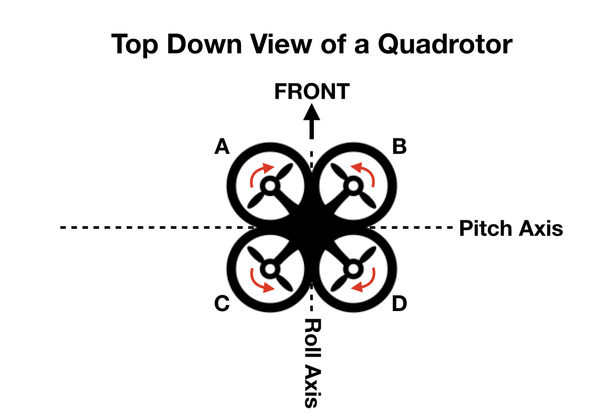
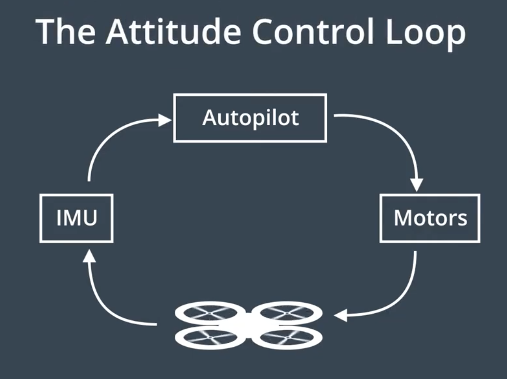
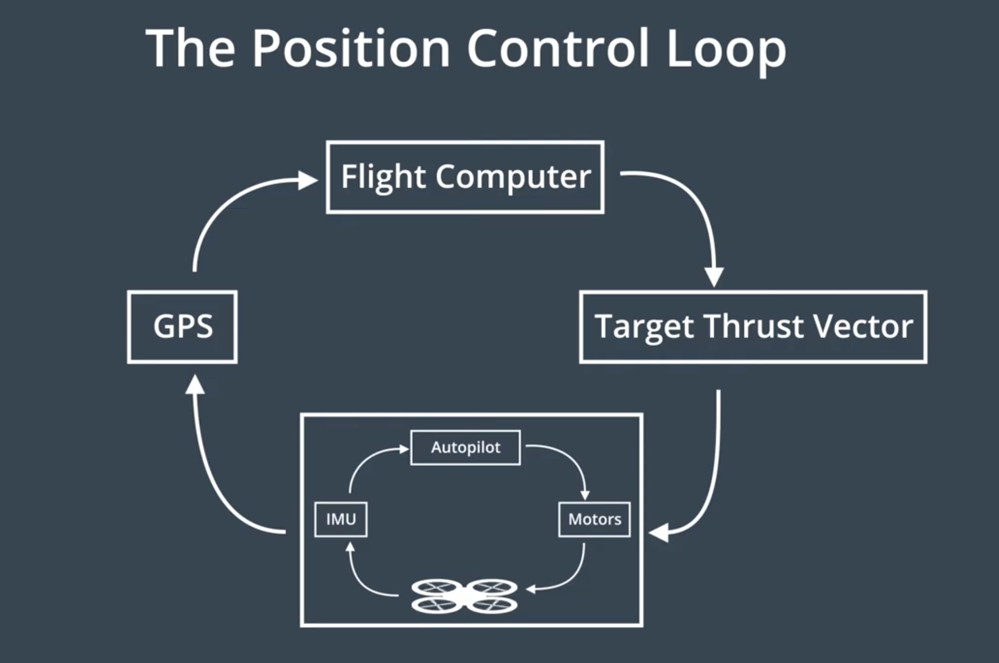

# CHAPTER - 1: INTRODUCTION TO AUTONOMOUS FLIGHT

## First Module: Welcome!


> Exciting time to focus on flying cars, we already see the basic version of a flying car in present time, its the quad-rotor  drone, from this we build up on topics to reach the flying car fantasy!

> Flying cars is going to be a state of the art industry, Companies focusing on flying cars in the present time are:


- Airbus


- Kitty Hawk


- Tencent


- NASA


- Boeing


- UBER


Projects being Built in this Course:


- The Backyard Flyer


- 3D motion Planning


- Building a controller for Quad-rotor in C++


- Estimation of a Flying vehicle's position


- Fixed wing control Project


                                              *END OF FIRST MODULE*           


## Module-2: Autonomous FLIGHT


> Autonomous flight is not a new thing if you have ever been on an airplane then you have already flew in an autonomous vehicle, the basics about autonomous flight can be best learned by learning about quadrotors, which later in this Course will be writing a code to make it fly autonomously.


> Wilbur and Orville wright brother were first one's to create an aircraft back in 1903 near kittyhawk, north carolina, the reason why there aircraft worked is due to the grater control of the airplane rather than stability, pilot had easier control over the airplane which made the flight possible, after that Elmer sperry invented the first autopilot know as "Mechanical Mike" which had a couple of gyroscopes that kept the airplane stable and helped in navigational tasks.


## Vehicle Morphology:  


> To investigate which aircraft configuration best suits the flying car, there are 2 configurations to consider 1) fixed wing style 2) rotary wing style, both have their own advantages, fixed style has higher flight efficiency and can travel larger distances, while rotary wing style had VTOL capability, the ability to land and takeoff vertically which makes it suitable for urban environment.


## Why Quad-rotors:


> Quad-rotors are tiny flying helicopters with 4 propellers, they are chosen as the platform to test code of Flying cars because of their light weight structure, cheaply available electronics such as flight controller and high density batteries such as Lipo and miniature GPS available in the market makes it suitable to learn about drones.


## Basic Quad-rotor components:


> A quad-rotor has 4 propellers attached to motor sitting on an X-frame, the propellers sitting opposite to each other basically rotate in the same direction, to cancel out the torque generated from each pair, apart from that a basic quad-rotor has following components:


- An IMU


- GPS


- Camera


- Flight controller


- Autopilot


## Below picture indicates the motor directions of a quad-rotor:


## 1) Quad-rotor Frame:


> A quad-rotor frame is a simple structure needed for fastening the electronics, a simple x-frame with good strength and flexibility will suffice for a frame, although studies are being conducted for an optimal frame in terms of material and aerodynamics.


## 2)Motors and Speed controllers:


> We use motors in quad-rotors as they are simple, even thought not efficient, they only need a battery, brushless dc motors are commonly used in quad-rotors as they work on principle of oscillating magnetic field they do not need any contact brushed which makes them efficient and faster than the brushed motors, ESC's are used to control the speed of the motor, the Autopilot send a command to ESC's regarding how much thrust is needed and the ESC adjust the magnetic field to a certain RPM of the motor.


## 3)Propellers:


> Each motor of a quad-rotor is attached to a propeller, the thrust generated by a propeller is the function of how fast the motor is spinning and also the properties of a propeller.


> Propellers drive the air in a single direction, its either a tractor which pushes the air downward or a pusher wich pushes the air upwards, quad-rotors basically have tractor propellers.


> Quad-rotors have two counter-clockwise rotors and two clockwise rotors in order to accommodate zero net torque.

> Propellers also have a radius, bigger the propeller quieter and efficient it gets, but there is a limit on propeller size based on the Frame.


> Pitch of the propeller is the twist associated with it in the plane of rotation, bigger pitch props generally displace more air and are efficient but produce lower thrust, hence if the purpose is to lift heavier loads we should go with lower pitch props but they are less efficient and drain the battery easily, there exists variable pitch propellers which can do low pitch for hover and high pitch for faster forward motion, but they are too complicated.


## 4)Batteries:


> Batteries used in the quad-rotors are Lithium Polymer batteries, just as the one's in laptops and cellphones but what makes them different is that they discharge very quickly which can be dangerous, Lipo batteries and a group of cells connected together and should be charged carefully, making sure one cell wont charge the other or discharge into other, which can be catastrophic.

> 99 percent of the battery power on the quad-rotor is consumed by the brushless d.c motors.


## 5) Driving a quad-rotor:


> when thrust on all 4 motors is same the quad-rotor hovers, to move the quad-rotor to the left thrust on the motors adjacent to each other will be increased, now increase int the thrust of 2 motors on the right causes the net thrust vector to shift to the left and the drone starts to move to the left, to make it move to the right same will be done but on to the left.


## Drone Movement:


## Drone Attitude Control:


> We know it takes to change thrust vectors of four motors on a quad-rotor to move it in different direction, it also doesn't take long to realize that it is really hard to manually change these thrust vectors every-time we want to change the drone's movement and for this purpose we need an Autopilot.


## Drone axis Diagram:





## 6) Autopilot:


> An Autopilot is a computer that is used to control the intended thrust vector, or thrust required to the motors, to control the Attitude of the drone it first needs to know the Attitude itself, how can this be done? using sensors.


## 7) IMU gyros:


> To find the attitude of the vehicle we use an inertial measurement unit, IMU consists of 3 gyroscopes and 3 accelerometers inside them, so when vehicle rotates in any of the 3 axis, we can measure change in its position using 3 gyroscopes placed at right angle to each other, if we want to measure this change relative to a reference then we need accelerometers for that purpose.


## 8) IMU accelerometers:


> IMU accelerometers use gravity as a reference to know which way down is, IMU has 3 accelerometers to measure acceleration in x, y and z directions simultaneously, we can calibrate these accelerometers when they are facing acceleration only due to gravity and use as a reference for gyros, present days we have MEMS or Micro electrical mechanical systems that enables us to embed this IMU on to small chip or a drone autopilot.


## 9) GPS :


> A GPS is used to get the position of the drone when it is moving, an IMU is used to verify the attitude of the vehicle but to actually know if the vehicle is reaching its position we need have GPS, GPS in an itself as a source for position is very inaccurate hence we use information from multiple sensors and fuse them to make the correct estimate of position.


## 10) Flight Computer:


> Flight computer is the brain of the drone which plans the high level stuff, it is responsible for planning the trajectory of drone and send the required thrust vector commands to the autopilot for producing required thrust to reach the destination.


## The Autopilot Loop:





## The Flight controller Loop:





                                            *END OF SECOND MODULE*          


# PROJECT-1: THE BACKYARD FLYER


> The Goal of this project is to implement a simple flight plan for a drone using Event-driven programming paradigm, This event-driven programming paradigm will allow to write drone programs that respond dynamically to a drone's changing and unpredictable world.


There are two modes for the drone in a simulator:


 - Manual- user is the pilot and motors need to be armed before performing tasks


 - Guided- Autonomous mode, drone can be controlled by providing scripts to the flight controller


## Manual Mode Video:

Click on the Picture to view the Video:


[](https://youtu.be/l7H_LN24nfk)


> Before running the code, environment setup need to be done in miniconda, after downland all the necessary requirements and repositories we can activate the environment using following command:

```sh
$ source activate fcnd
```


## Guided mode drone control:


> Now we write our own python code to make the drone move by itself in self-guided mode, for that 3 pre-requisites must be fulfilled:


- Activate the Environment.


- Open the python shell or python notebook.


- Make sure the simulator is open and guided mode is selected.


Click on the picture to view the Video:


[](https://youtu.be/8Yp-g_g8OAc)


## Event Driven programming:

> Event driven programming is paradigm in which flow execution is defined by external events rather than following a predefined sequence of Steps, we use this paradigm while making GUI's, Drones and Chatbots.
